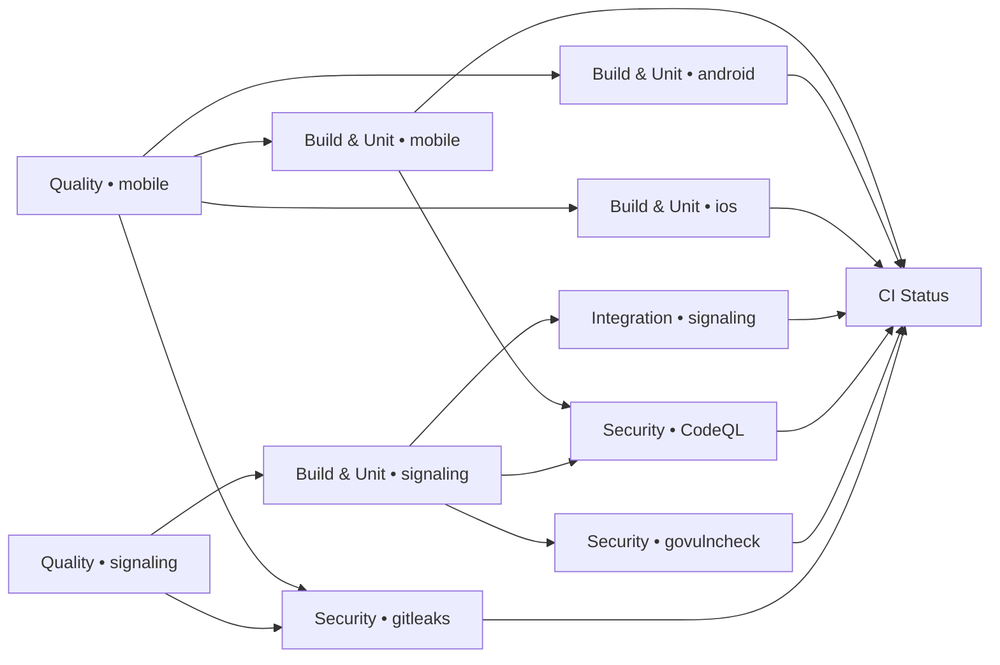

# CI Pipeline

One workflow, `.github/workflows/ci.yml`, gates every change. It runs on pushes to `main`
and to `feat/**`, `fix/**`, `hotfix/**`, `chore/**`, `ci/**` branches, and on pull
requests into `main`. Newer runs on the same branch cancel older ones.

## Stages



| Stage | Job | What it checks | Reproduce locally |
|---|---|---|---|
| 1. Quality | `Quality • mobile` | `dart format` clean, `flutter analyze --fatal-infos` | `cd packages/mobile && dart format --output=none --set-exit-if-changed lib test && flutter analyze --fatal-infos` |
| | `Quality • signaling` | `go mod verify`, `go.mod` tidy, `gofmt -s`, `go vet` (both build tags) | `cd packages/services/signaling && gofmt -s -l . && go vet ./... && go vet -tags=integration ./...` |
| 2. Build & Unit | `Build & Unit • mobile` | `flutter test --coverage` (coverage uploaded as an artifact) | `cd packages/mobile && flutter test` |
| | `Build & Unit • android` | `flutter build apk --debug`, which compiles the Kotlin PTT layer | `cd packages/mobile && flutter build apk --debug` (needs JDK 17) |
| | `Build & Unit • ios` | `flutter build ios --debug --no-codesign`, which compiles the Swift PushToTalk layer | `cd packages/mobile && flutter build ios --debug --no-codesign` (macOS) |
| | `Build & Unit • signaling` | `go build`, unit tests with `-race`, container image build | `cd packages/services/signaling && go test -race ./... && docker build .` |
| 3. Integration | `Integration • signaling` | Real WebSocket clients against the real handlers: join, peer list, offer/answer/ICE relay, PTT broadcast, room isolation, disconnect | `cd packages/services/signaling && go test -race -tags=integration ./cmd/...` |
| 4. Security | `Security • CodeQL (go / actions)` | Static analysis of the Go service and of the workflows themselves | GitHub only |
| | `Security • govulncheck` | Known vulnerabilities reachable from the signaling service | `govulncheck ./...` in `packages/services/signaling` |
| | `Security • gitleaks` | Secrets anywhere in git history | `gitleaks git --redact .` |
| 5. Aggregate | `CI Status` | Fails unless every job above succeeded | n/a |

**`CI Status` is the only required status check on `main`.** New jobs automatically
become merge-blocking once they're added to its `needs:` list, so branch protection never
has to be edited when the pipeline grows.

## Toolchain pins

Set once in the workflow `env:` block:

| Tool | Version | Keep in sync with |
|---|---|---|
| Flutter | `3.47.1` (Dart 3.13) | the version you develop with (`flutter --version`) |
| Go | `1.27.x` | `packages/services/signaling/Dockerfile` builder image |
| Java | `17` | `jvmTarget` / `JavaVersion` in `packages/mobile/android/app/build.gradle` |

The previous pipeline derived Flutter from `pubspec.yaml`'s *lower bound* (`>=3.16.0`),
which installed a Dart SDK too old for current dependencies and failed at `pub get`.
Always pin explicitly.

## Local hooks (lefthook)

`lefthook.yml` runs the fast gates before code leaves your machine:

- **pre-commit** (only on staged file types): `dart format`, `flutter analyze`, `gofmt`, `go vet`
- **pre-push**: `flutter test`, Go unit + integration tests

Install once per clone:

```bash
brew install lefthook
lefthook install
```

Don't bypass hooks with `--no-verify`. If a hook is wrong, fix the hook.

## What is deliberately *not* automated

- **Mobile end-to-end / headset testing.** Bluetooth headset buttons need physical
  devices and vary per headset (AVRCP firmware differences). Use `TESTING.md` and the
  Milestone A two-device checklist in `docs/superpowers/plans/2026-08-14-ptt-webrtc-mvp.md`.
- **CodeQL for Dart and Kotlin.** CodeQL doesn't support Dart. Kotlin analysis needs a
  full Gradle build inside CodeQL; revisit if the native layer grows.
- **Legacy `packages/server`.** It only contains a placeholder and a skipped test; the
  live backend is `packages/services/signaling`.

## Troubleshooting

| Failing job | Usual cause | Fix |
|---|---|---|
| Quality • mobile | Unformatted file or analyzer info | `dart format lib test`, then `dart fix --apply` |
| Quality • signaling | `go.mod` not tidy, or `gofmt` | `go mod tidy`, `gofmt -s -w .` |
| Build & Unit • android | Gradle/AGP vs Flutter version drift | Build locally with the pinned Flutter; update AGP/Gradle together |
| Build & Unit • ios | CocoaPods resolution | `cd ios && pod repo update && pod install` locally, commit `Podfile.lock` |
| Integration • signaling | Protocol change broke a relay path | Run the integration command above with `-v` |
| Security • govulncheck | New advisory in a dependency or the Go stdlib | Bump the module (`go get <module>@<fixed>`) or `GO_VERSION` + Dockerfile |
| Security • gitleaks | Secret committed | Rotate it first, then remove it. Only add to `.gitleaksignore` after review, with a comment saying why |
| CI Status | Any job above failed or was cancelled | Fix the named job; the log lists every job's result |
